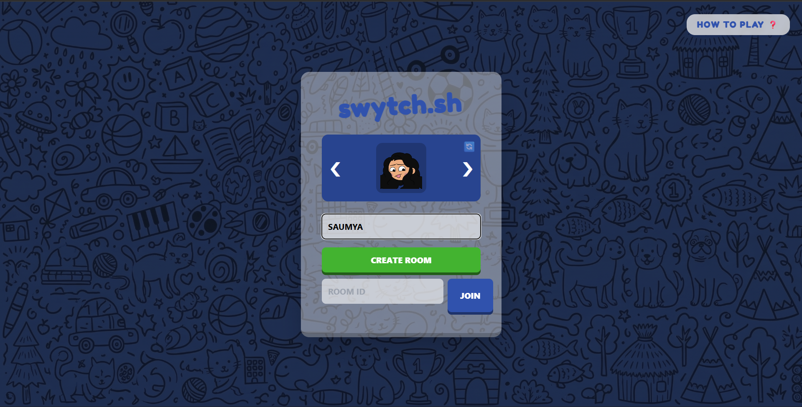
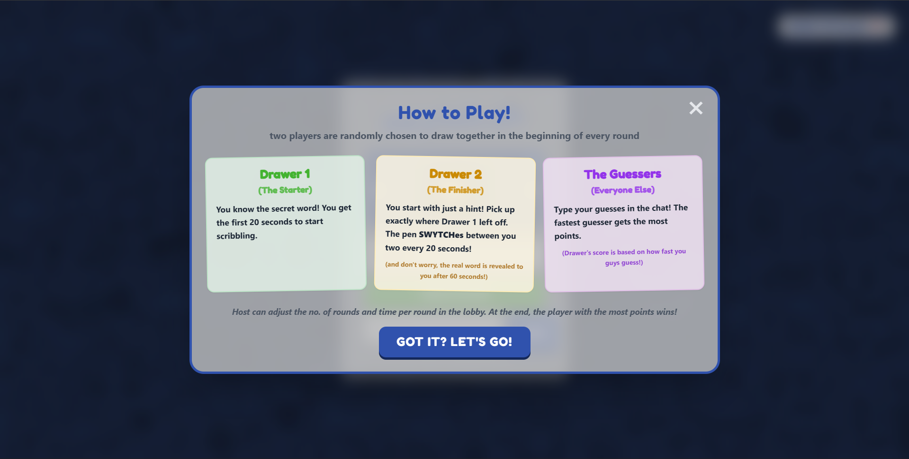
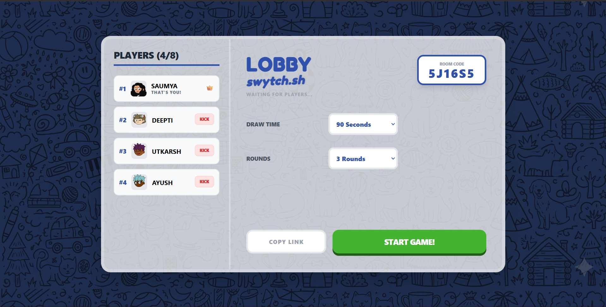
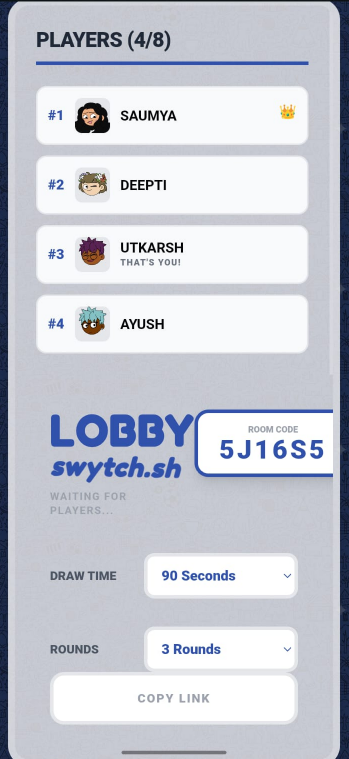
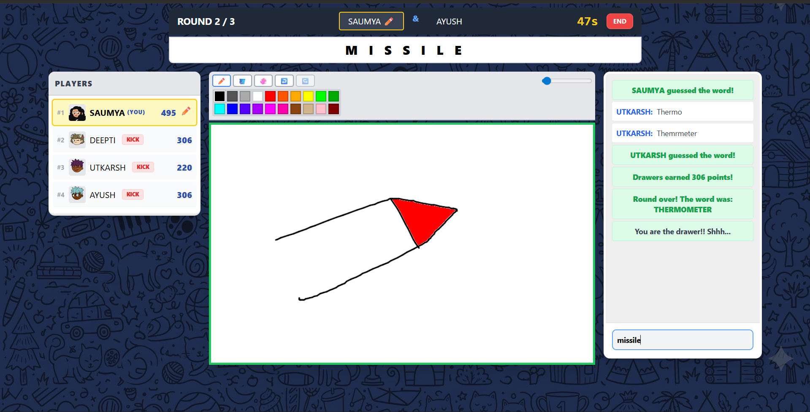
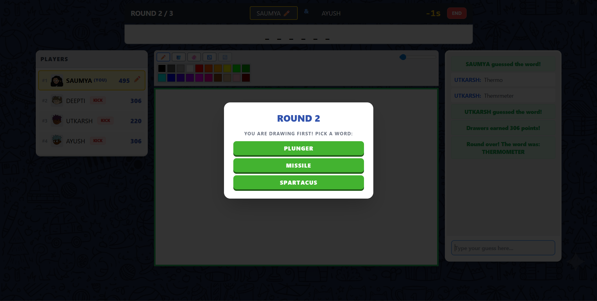
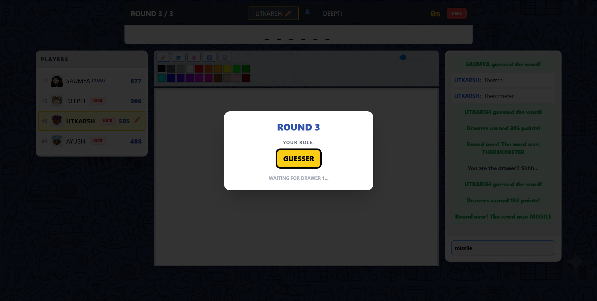
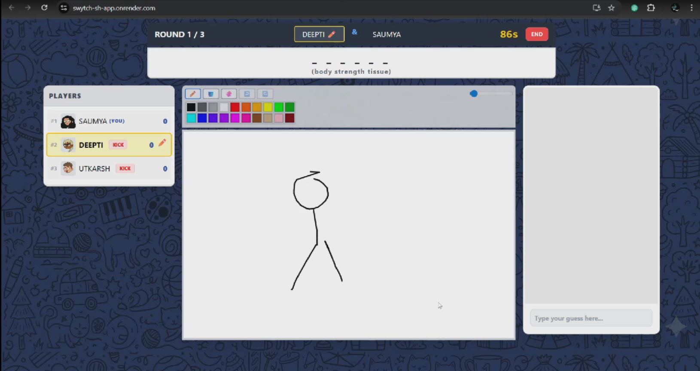
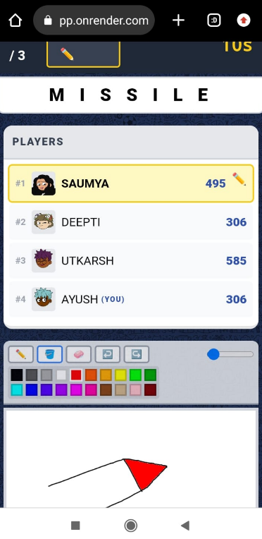

# Swytch.sh 
A real-time, collaborative multiplayer drawing and guessing game.

swytch.sh is a unique twist on the classic "Pictionary" style game. Unlike traditional games where one person draws the entire word, in swytch, two players collaborate on a single drawing while rest of the players guess. The catch? The pen "swytches" between them every 20 seconds. It’s a test of intuition, teamwork, and artistic speed.

---

[**PLay Live (click here)**](https://swytch-sh-app.onrender.com/)

> **Note:** This project is hosted on a Render free tier. If the site has been inactive, the backend server may take **up to 50 seconds** to "wake up" before you can create or join a room.

---

[**DEMO (click here)**](https://drive.google.com/file/d/13nes1ccvFgGopksQT2okGlfi8Kqg0goJ/view?usp=drivesdk)

> **Note:** This demo shows a complete gameplay between 3 players at a time.

---

## 🚀 Key Features
* **Unique "Relay" Mechanic:** Two players (The Starter and The Finisher) share the drawing duties in 20-second intervals.
* **Real-Time Interaction:** Powered by Socket.io for instantaneous drawing sync and chat-based guessing.
* **Fully Responsive:** Play on a laptop with a massive canvas or on your phone with a touch-optimized UI.
* **Custom Game Settings:** Hosts can adjust the number of rounds, drawing time to fit their group, and can kick players out.
* **Dynamic Avatars:** Choose from a library of 50+ unique pixel-art characters.
* **Smart Tools:** Includes a flood-fill (bucket) tool, eraser, and full Undo/Redo history.

---

## 🎮 How to Play
1.  **Join the Lobby:** Enter your name, pick an avatar, and share your Room ID with friends.
2.  **The Roles:** 
    * **Drawer 1 (The Foundation):** You see the secret word immediately. You have 20 seconds to start the sketch before the pen is taken away.
    * **Drawer 2 (The Finisher):** You start with only a hint (dashes and a few letters). You must pick up exactly where Drawer 1 left off. The secret word is revealed to you only after 60 seconds.
    * **Guessers:** Everyone else watches the live "swytch" and types their guesses in the chat.
3.  **The Swytch:** The drawing control toggles between the two artists every 20 seconds until time runs out.
4.  **Scoring:** Points are awarded based on how quickly the word is guessed. Artists earn points when their peers are successful.
5. In the beginning of every round in the game, two new drawers are chosen at random.
---

## 📸 Screenshots

### A. Landing Page
*Read the instructions, enter your name, choose your identity and get in the game either by creating your own lobby or entering into an existing one though room code*



### B. Game Lobby
*Host controls for setting up rounds, timer and managing players. each player can see the lobby, other participants*



### C. Desktop Gaming View
*Game UI for a large drawing area with side-by-side chat - which won't any player type the answer so that the answer does not get revealed while others guess*


### D. Drawers and guessers
*Role is assigned to each and every player at the begining of every round. Drawer 1 gets 3 options from which he can choose any of them to draw, while the Drawer 2 and guesser wait as drawer 1 selects the word*



### E. The Reveal
*For first 60 seconds, drawer 2 only gets to see a hint about the word, and after 60 seconds, the word is revealed to drawer 2 (the first screenshot is from a differnt game, i forgot to take one in during game.. lol)*



---

## 🛠️ Tech Stack
* **Frontend:** React.js, Tailwind CSS
* **Backend:** Node.js, Express
* **Real-time Communication:** Socket.io (WebSockets)
* **Deployment:** Render (Web Service & Static Site)

---

## 🛠️ Installation & Local Setup

1. **Clone the repository:**
   ```bash
   git clone https://github.com/sgupta701/SWYTCH.SH_a_tag_team_pictionary.git
   ```

2. **Setup Backend:**
   ```bash
   cd backend
   npm install
   node server.js
   ```

3. **Setup Frontend:**
   ```bash
   cd ../frontend
   npm install
   npm start
   ```

4. **Configuration:**
   Update the socket connection in frontend/src/App.js to http://localhost:4000 for local development.
